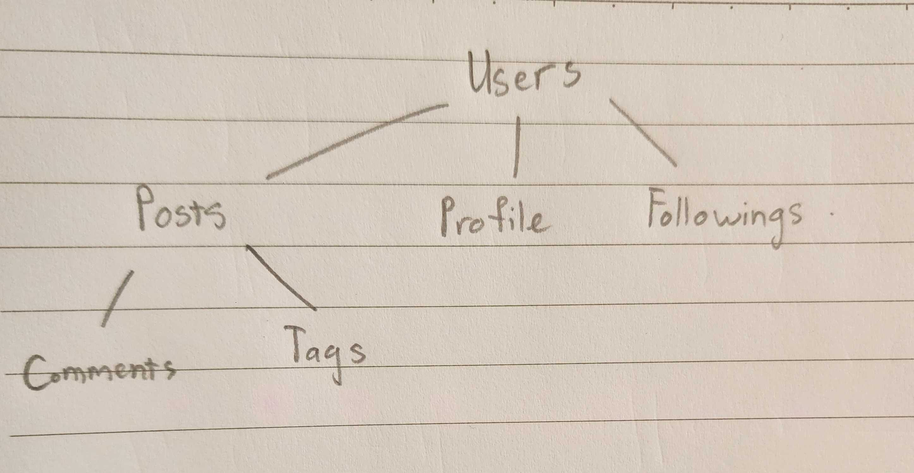

1. Xác định các resources trong miền:

- 'posts': /users/[id]/posts
- 'comments': /users/[id]/posts/comments?post_id=[pid]
- 'tags': /users/[id]/posts/tags?post_id=[pid]
- 'profile': /users/[id]/profile
- 'follow': /users/[id]/followings

2. Phân loại collection/item/sub-resource

- collection: 'post', 'follow'
- item: 'profile'
- sub-resources: 'comments', 'tags'

3. Vẽ sơ đồ endpoints tree và quyết định version segment

- version segment: v1, nằm ở đầu resource, e.g. /api/v1/users/posts?user_id=[id]

4.
