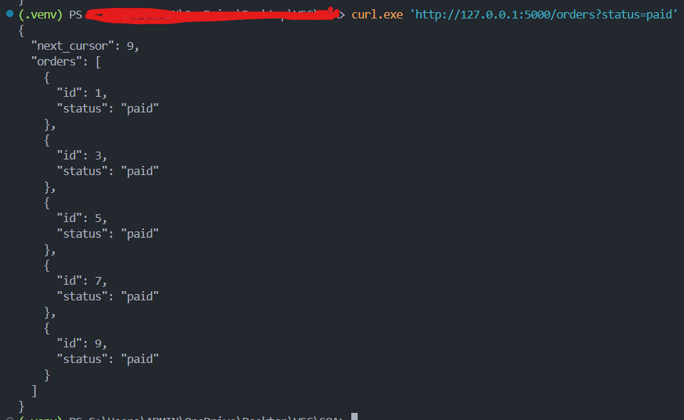
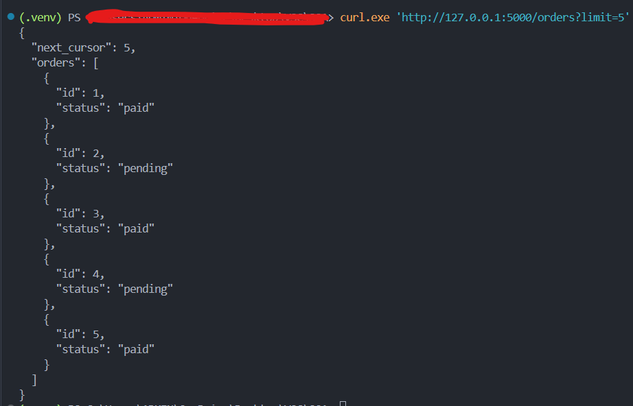
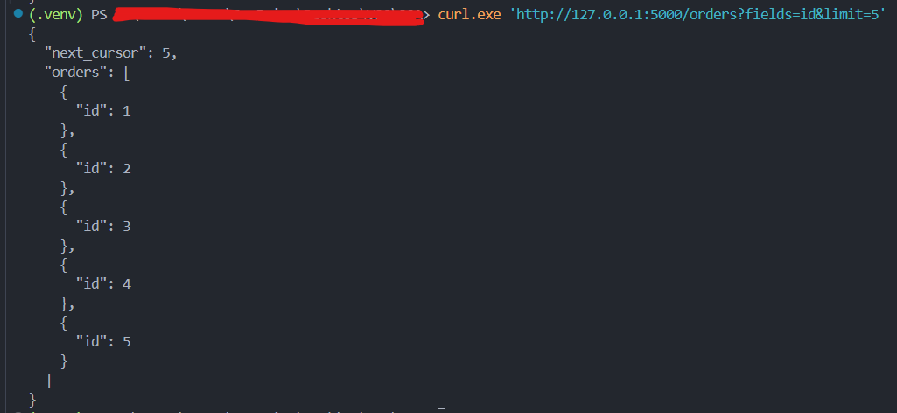
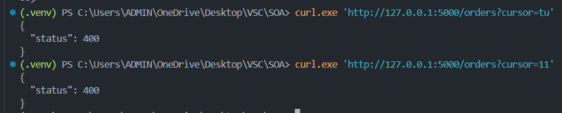

1. curl.exe 'http://127.0.0.1:5000/orders?status=paid'
   

2. curl.exe 'http://127.0.0.1:5000/orders?limit=5'
   

3. curl.exe 'http://127.0.0.1:5000/orders?fields=id&limit=5'
   

4. curl.exe 'http://127.0.0.1:5000/orders?cursor=tu' || curl.exe 'http://127.0.0.1:5000/orders?cursor=11'
   
